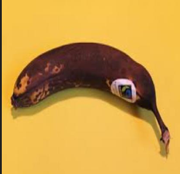
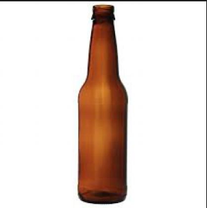

# Intelligent recycling system

An automated waste sorting system leveraging computer vision and MongoDB for efficient classification and management of waste materials."

## Table of Contents

1. [Introduction](#introduction)  
2. [Technologies Used](#technologies-used)  
3. [Installation & Setup](#installation--setup)  
4. [How to Use the models](#usage)  
5. [Project Structure](#project-structure)  
6. [Dataset & Processing](#dataset--processing)  
7. [Model & Algorithm](#model--algorithm)  
8. [Database Integration](#database-integration)  
9. [Results & Performance](#results--performance)  
11. [Contributors](#contributors)    

---

## 💡 Introduction  

This project automates waste sorting using computer vision and MongoDB. It leverages deep learning technique to classify waste into different categories, improving waste management efficiency and recycling processes.  

## 🛠 Technologies Used  

- **Computer Vision** (OpenCV, PyTorch)  
- **Deep learning** (YOLOv11, YOLOv12)  
- **Database**: MongoDB  
- **Language/IDE**: Python, Anaconda, VSCode     

## 🔧 Installation & Setup  

### Prerequisites  
- Python 
- Anaconda  
- MongoDB installed and running  


### Clone the repository

Download repo from https://github.com/Ahmedfull02/intelligent-recycling-system 

## 📂 Project Structure  

```plaintext
intelligent-recycling-system
│   data.yaml
│   environment.yml
│   │   readme.md
│   yolo-load-model.ipynb
│   yolo-train-colab.ipynb
│   yolo11n.pt
│   Yolov11m_trained_80_epoch.pt
│   Yolov11n_trained_80_epoch.pt
│
└───runs
```

# Install dependencies
Open Anaconda :

Select **Environement**


Click on **Import**


Select the **Path** of *environment.yml* file in project folder.


>[!NOTE]:
>Don't worry, It take too much time to install all dependencies 👍.


then run notebook by anaconda or VSCode.  

## ▶️ Usage 
As you see in the repo, it exist two notebooks:
- *yolo-load-model.ipynb*
- *yolo-load-model.ipynb*

### Train
To train model it is necessary to use ***Google Colab***, because it offers free usage of GPU.
1) Import The Notebook to **Colab**
2) Choose Runtime Environment which has **GPU T4**
3) Run all cells 

>[!NOTE]:
>In the **model.train** cell modification of the *epoch* time is acceptable.
>
>```results = model.train(data="garbage-classification-3/data.yaml", epochs="you choosed numberr", imgsz=640) ```
>
>It might be error encountered that is related to data, by modifying data path with dataset path could be solved.   

4)All results are saved in **run** folder.

### Load
>[!NOTE]:
>In This repo the Models already trained.

1. In model.load cell, put the wanted model. 
```
from ultralytics import YOLO

# Load a COCO-pretrained YOLO11n model
model = YOLO("Wanted model")

# Display model information (optional)
model.info()
```
Models existed are (Trained in 80 Epoch):
- Yolov11n_trained_80_epoch.pt
- Yolov11m_trained_80_epoch.pt

## 📊 Dataset & Processing  

- Uses an annotated dataset of 6 types of trash images/images.


| BIODEGRADABLE | CARDBOARD | GLASS | METAL | PAPER | PLASTIC|
|--------------|-----------|-------|-------|-------|--------|
||||||

- Preprocessing :

    - Auto-Orient: Applied
    - Resize: Stretch to 416x416
- Augmentations
    - Outputs per training example: 1
    - Flip: Horizontal, Vertical
    - 90° Rotate: Clockwise, Counter-Clockwise, Upside Down


## 🧠 Model : Utralytics YOLO v 11  
Introducing Ultralytics YOLO11, the latest version of the acclaimed real-time object detection and images/image segmentation model. YOLO11 is built on cutting-edge advancements in deep learning and computer vision, offering unparalleled performance in terms of speed and accuracy.
## 🗄 Database Integration  

- MongoDB stores images/image metadata, classification results, and history.  
- Sample schema:  

```json
{
  "_id": "ObjectID",
  "images/image": "Binary",
  "detected_item": "Class",
  "confidence":"Number between 0.8 and 1",
  "timestamp": "time",
  "processing_time:":"time"
}
```

## 📈 Results & Performance  


## 👥 Contributors  

- **Abd Elkarim ACHOWAL** - [GitHub](https://github.com/Achowal)
- **Ahmed ADNANE** - [GitHub](https://github.com/Ahmedfull02)
- **Ilyas ZIAT** - [GitHub](https://github.com/ziatily2)
